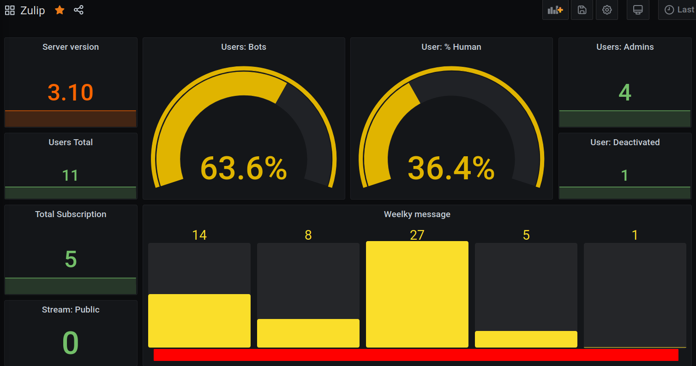

# Zulip prom exporter

## Usage

- Create a bot following this documentation: <https://zulip.com/api/api-keys>

- Add the bot in each streams that you want to be exported

### Environment variable

|     Environment Variable     | Description                                                    | Default   | Required |
|:----------------------------:|----------------------------------------------------------------|-----------|:--------:|
|         `ZULIP_EMAIL`        | Zulip email from zuliprc                                       |           |    ✅    |
|        `ZULIP_API_KEY`       | Zulip api-key from zuliprc                                     |           |    ✅    |
|          `ZULIP_SITE`        | URL where your Zulip server is located                         |           |    ✅    |
|            `HPORT`           | Http port to listen on                                         |  `9863`   |    ❌    |
|            `SLEEP`           | Time to wait in seconds beetween metric grabbing cycles        |  `120`    |    ❌    |

## Docker compose example

```
  zulip-exporter:
    container_name: zulip-exporter
    restart: unless-stopped
    image: quay.io/brokenpip3/zulip-exporter:0.0.1
    labels:
      io.prometheus.scrape: true
      io.prometheus.port: 9863
      io.prometheus.path: /metrics
    env_file:
      - .env-zulip
    ports:
      - "9863"
```

## Kubernetes

see [example](./kubernetes)

## Metrics

- Server info: `zulip_server`

- Users info: `zulip_user_*`

- Streams info: `zulip_stream_*`

## Prometheus rules examples

see [rules examples](./kubernetes/zulip-rules.yaml)

## Grafana dashboard



see [example dashboard](./grafana/dashboard.json)

## Todo

- [ ] When this <https://github.com/zulip/zulip/pull/17038> will be merged check if new metrics can be obtained from administrator privilegies.

## Questions

**Q:** Why you did this?

**A:** 🤷‍♂️
